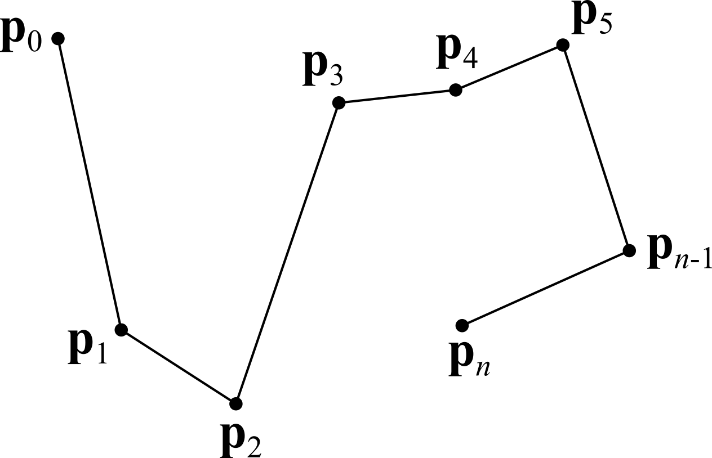

# Curves constructed from a set of points

Consider the construction of curves that, for parameter values $t_{0}, t_{1}, ..., t_{n}$, pass through the specified points $\textbf{p}_{0}, \textbf{p}_{1}, ..., \textbf{p}_{n}$. $\textbf{p}_{i}, i=0,1,...n$ points are called _control points_. $t_{i}, i=0,1,...n$ parameters are called _nodes_.

Curves constructed on a set of equally spaced nodes are called _uniform_. For them, the equality $t_{i}-t_{i-1}=t_{i+1}-t_{i}$ holds. Curves constructed on a set of unequally spaced nodes are called _non-uniform_.

## Polyline
A polyline is the simplest curve. It consists of segments sequentially connecting the specified points. The radius vector of a polyline is defined by the equality

$\textbf{r}(t)=\textbf{p}_{i}(1-w)+\textbf{p}_{i+1}w$, where $w=\frac{t-t_{i}}{t_{i+1}-t_{i}}$ and $t_{i} \leq t \leq t_{i+1}$.

The parameter $w$ is a local parameter on the section of the curve between the points $\textbf{p}_{i}$ and $\textbf{p}_{i+1}$.

A straight line segment is a special case of a polyline that contains a single section. The radius vector of the segment is calculated by the formula

$\textbf{r}(t)= \textbf{p}_{0}(1-t)+\textbf{p}_{1}t$.

## Spline

